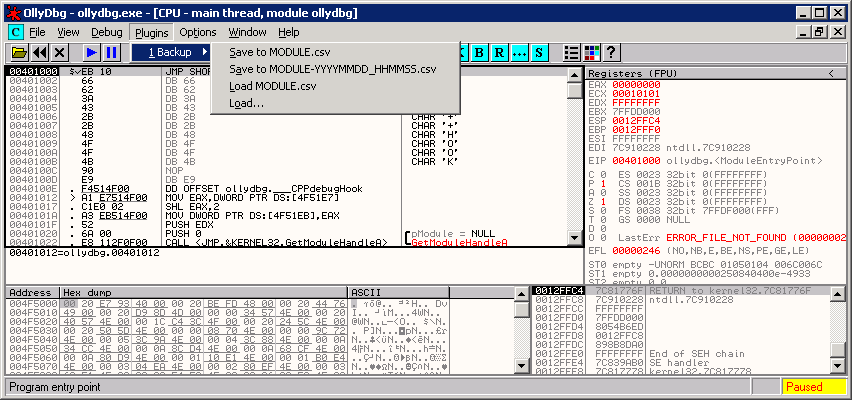
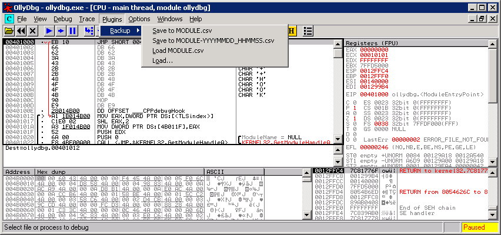

OllyDbg v1.10 / v2.01 backup plugin
===================================

Download latest hybrid (v1.10 & v2.01) binary release: [backup.dll](https://github.com/hifi/ollydbg-backup/raw/binary-release/backup.dll)

**NOTE**: The latest release depends on *Microsoft Visual C++ 2010 Redistributable
Package*. Get it for [x86](http://www.microsoft.com/en-us/download/details.aspx?id=5555)
or [x64](http://www.microsoft.com/en-us/download/details.aspx?id=14632) Windows.

This simple plugin allows saving the loaded executable labels and comments to a
CSV file and later loading them back in. You can store, share, modify and merge
your notes with ease and never lose your notes because OllyDbg flipped and threw 
them all out (it can happen).

The CSV file structure is as follows:

    RVA,label,comment

Output files are compatible with more feature rich *pyudd* which was the
inspiration for this plugin. Kudos to *libcsv* for easy to use CSV library for
the C programming language.

pyudd - http://code.google.com/p/pyudd/  
libcsv - http://sourceforge.net/projects/libcsv/
